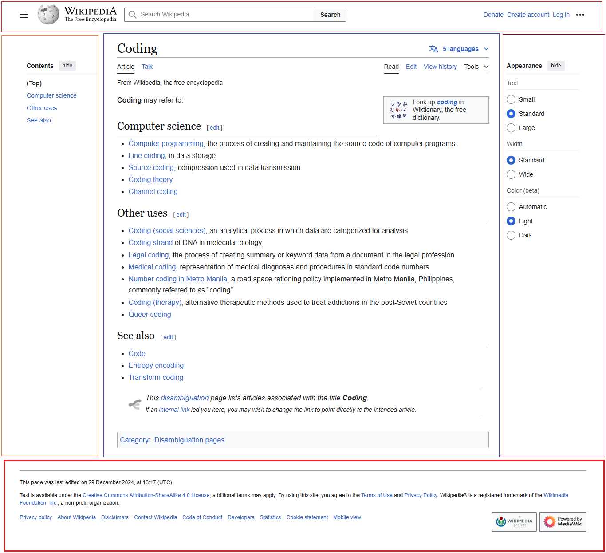

# Challenge One: [ wekipidia Page Design )

## **Version:** 1.0.0

## **Date:** 24-Jan-2025.

---

**Author:** Dulon Mahadi Molla  
**Affiliation:** Student Of CSE.  
**Location:** Narayanganj, Casara- Dhaka.

# Project Setup :

- Clone This Project From Here : [Github](https://github.com/14HAK/monster.git)


# Project Folder Structure :

```javascript
wekipidia-page-design/
├── public/ 📂
│   └── index.html 📝
├── src/ 📂
│   ├── index.js 📝
│   └── App.js 📝
├── package.json 📝
├── webpack.config.js 📝
└── .babelrc 📝
```

# Layout Tags :
```javascript

<header>
    <h1>Website Title</h1>
    <nav></nav>
</header>

<nav>
    <ul>
        <li><a href="#">Home</a></li>
    </ul>
</nav>

<main>
    <h2>Main Content</h2>
    <p>This is the primary content of the page.</p>
</main>

<section>
    <h2>About Us</h2>
    <p>Information about our company.</p>
</section>

<article>
    <h2>Blog Post Title</h2>
    <p>Content of the article...</p>
</article>

<aside>
    <h3>Related Articles</h3>
    <ul>
        <li><a href="#">Article 1</a></li>
    </ul>
</aside>

<footer>
    <p>&copy; 2025 Your Company</p>
</footer>

<address>
    Contact us at <a href="mailto:info@example.com">info@example.com</a>
</address>

<figure>
    
    <figcaption>Caption for the image</figcaption>
</figure>

<dialog open>
    <p>This is a dialog box.</p>
</dialog>

<details>
    <summary>More Information</summary>
    <p>Here is the hidden content.</p>
</details>

```


# Project Overview :

- **Try Your Own:**
  - 😉