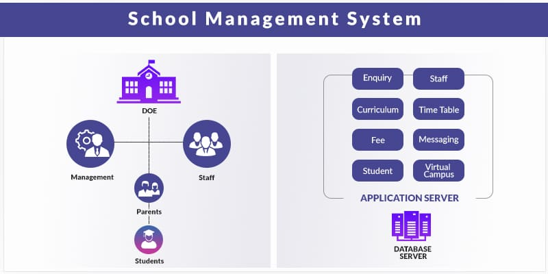

# Shool Management System Frontend

## **Version:** 1.0.0

## **Date:** 24-Jan-2025.

---

**Author:** Dulon Mahadi Molla  
**Affiliation:** Student Of CSE.  
**Location:** Dhaka.

# Project Setup :

- Shool Management System : [Click Here](https://github.com/14HAK/monster/tree/master/school-management)
```javascript
git clone git@github.com:14HAK/monster.git git@github.com:14HAK/monster.git school-management
cd school-management
code .

yarn install
yarn run dev
```

# Project Overview :

```javascript
// Step 1:
* demo "instruction" of backend system.

// Step 2:

```

# Packages [ yarn environment ]:

```html
node, express, nodemon, 

```